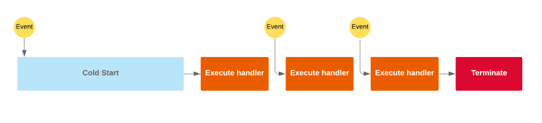
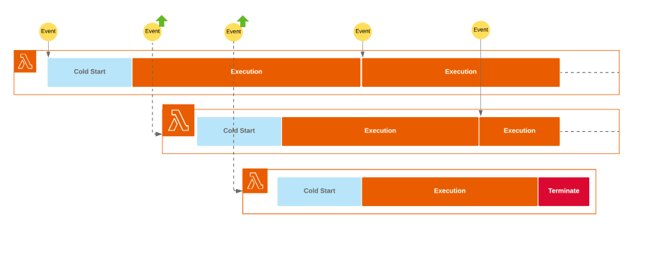
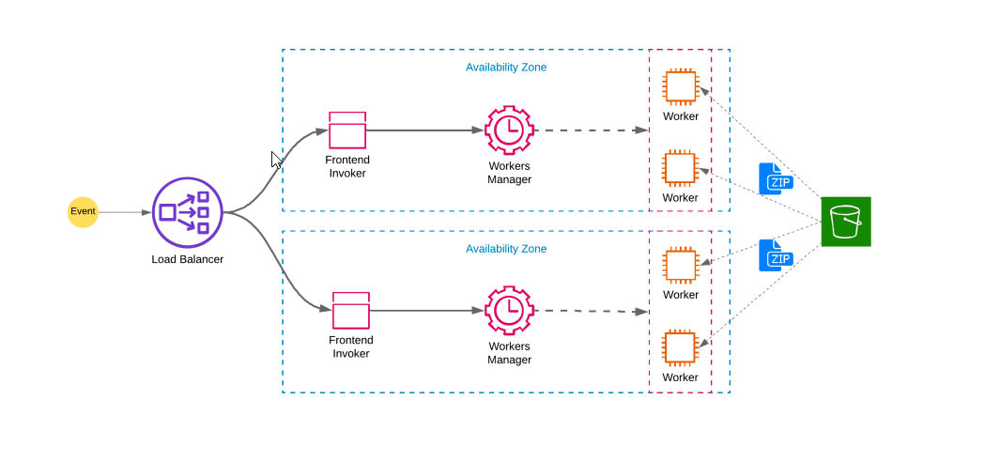

<div align="center">

## AWS-Lambda

</div>

AWS Lambda is a serverless, event-driven compute service that lets you run code for virtually any type of application or backend service without provisioning or managing servers. You can trigger Lambda from over 200 AWS services and software as a service (SaaS) applications, and only pay for what you use.







### How to run

Here I will be deploying Mobilenet V2 model trained on Cifar10 dataset. To deploy the model to Lambda service, I will be using the [serverless](https://www.serverless.com/) framework.

```bash
# Install Node JS
curl -sL https://deb.nodesource.com/setup_14.x | sudo -E bash -
sudo apt install nodejs

# Install Serverless
sudo npm i -g serverless

# Build the docker image
docker build -t cifar10-serverless .

# Test the docker locally
docker run --rm -it -p 8080:8080 cifar10-serverless

curl --location --request POST 'http://localhost:8080/2015-03-31/functions/function/invocations' \
--header 'Content-Type: application/json' \
--data-raw '{"body": "Replace with base64 string here"}'

# Push the docker image to ECR, add appropriate IAM roles and then deploy using
serverless deploy

# Using Stages and Different Region
serverless deploy --stage production --region eu-central-1

# Removing Deployment
serverless remove

```
